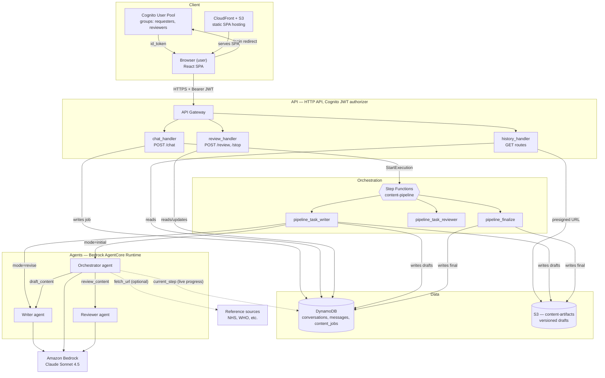
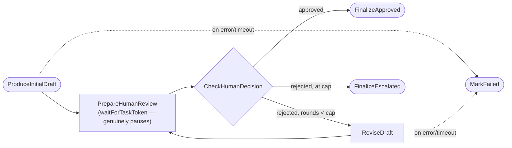

# Rennie Content Pipeline

An AI-agent content production pipeline on AWS: a Writer, a Reviewer, and an
Orchestrator agent (Bedrock AgentCore Runtime, Strands Agents SDK) coordinate
to turn a structured content brief into a brand/compliance-reviewed draft,
with a human reviewer as the final gate before anything ships. Built for
Bayer/Rennie-branded consumer health content.

**Status:** the Web Article content type is fully built and load-tested end
to end. Product Detail Page, Consumer Email, and Social Media Posting are
"coming soon" placeholders in the UI — same backend contract, no form built
yet.

## How it works, in one paragraph

A requester fills in a structured brief (market, brand, persona, goal, word
limit, optional reference source URL, free-text instructions) and submits
it. The Orchestrator agent coordinates the Writer and Reviewer through up to
3 AI-only review rounds, then hands the draft to a human reviewer — the
pipeline genuinely pauses (no polling, no compute running) until someone
approves, rejects with feedback, or the job is stopped outright. A rejection
sends it back through the Writer directly (skipping the AI review loop,
since a human already reviewed it) for another round, up to a configured
cap, then auto-escalates. Every draft version is saved as its own artifact,
and the requester's page shows live "which agent is working right now"
status while a run is in progress.

## Architecture at a glance

The Step Functions state machine's own states, in detail — one execution
per job, reused across the whole job's lifetime including every revision:

**By the numbers:** 6 Lambda functions · 1 Step Functions state machine · 3
Bedrock AgentCore Runtime agents · 8 API routes · 3 DynamoDB tables · 2 S3
buckets · 7 Terraform modules.

For the richer version — repo layout, the full frontend→Orchestrator call
chain with concrete config values, and the "learned the hard way" resilience
notes — see [`docs/architecture.html`](docs/architecture.html).

## Repo layout

| Folder | What's in it |
|---|---|
| `agents/` | The 3 AgentCore Runtime containers — `writer/`, `reviewer/`, `orchestrator/` — each a Python `agent.py` + `Dockerfile` (ARM64, required) |
| `lambdas/` | The 6 Lambda handlers — 3 behind API Gateway, 3 behind Step Functions |
| `frontend/` | React + Vite + TypeScript SPA |
| `terraform/modules/` | 7 reusable IaC modules (`agentcore_runtime`, `api`, `auth`, `data_store`, `frontend_hosting`, `knowledge_base`, `pipeline_orchestration`) |
| `terraform/envs/dev/` | The one deployable environment — wires every module together |
| `scripts/` | `deploy_agents.sh` (build+push agent images), `generate_frontend_env.sh` (write frontend env from Terraform outputs) |
| `docs/` | `deployment.md` (new-account deploy runbook), `engineering-guide.md` (day-to-day dev workflow) |
| `kb-sample-content/` | Sample docs used for the one-off Knowledge Base test — not currently deployed |

## Getting started

- **Deploying this to an AWS account (new or existing):** [`docs/deployment.md`](docs/deployment.md) — the full step-by-step, including what's genuinely manual (Bedrock model access, the test user) vs. scripted.
- **Working on the code day to day:** [`docs/engineering-guide.md`](docs/engineering-guide.md) — local dev setup, how to redeploy after each kind of change, and the debugging playbook this project's own real production bugs were actually root-caused with.

## Tech stack

Terraform · AWS Bedrock AgentCore Runtime · Strands Agents SDK · AWS Step
Functions · API Gateway (HTTP API) · Lambda (Python 3.12) · DynamoDB ·
Cognito · S3 + CloudFront · React + Vite + TypeScript.

## Deliberately not always running

Knowledge Base (OpenSearch Serverless + Bedrock KB, `terraform/modules/
knowledge_base`) was built and tested end to end once, then commented out
of `terraform/envs/dev/main.tf` and torn down — OpenSearch Serverless bills
continuously even idle, so it only stands up for a deliberate, time-boxed
test, never left running by default.
